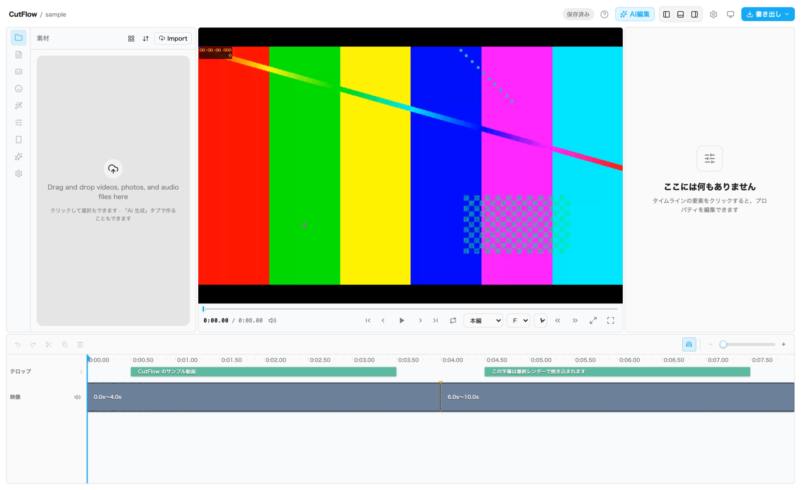
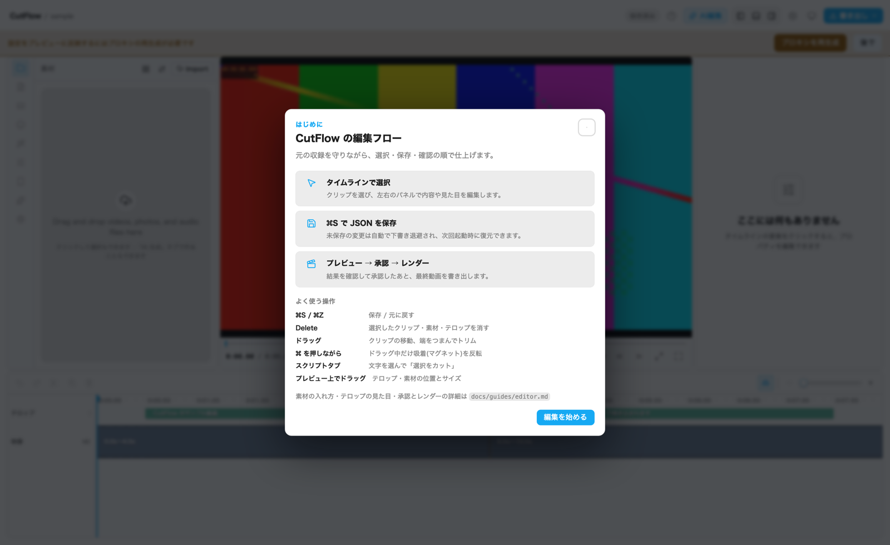

# GUI エディタの使い方

> 画面を見ながら引くための操作リファレンス。エディタの**画面内でも**同じ内容を
> ヘッダーの「?」から開ける(初回に出る案内と同じダイアログ)。
> 起動オプション・バックグラウンド運用・掃除は [tools-and-ops.md](tools-and-ops.md)、
> 初回セットアップは [../getting-started.md](../getting-started.md) を参照。

FrameWright は「全部 AI 任せ」ではなく、**まずエディタでプロジェクトを開き、
必要な自動処理だけ明示実行し、以降は人間が編集 ↔ 確認を往復する**道具。
エディタが入口で、CLI は同じ処理を叩くもう一方の口(格下ではない)。
このページはその往復のうち「エディタ側で何をどう触るか」だけを扱う。

## 起動

```sh
node src/cli.ts editor                                            # プロジェクト一覧
node src/cli.ts editor ~/Movies/framewright/2026-07-02-my-recording   # 直接開く
```

- 起動すると `http://127.0.0.1:4310` を案内するのでブラウザで開く
  (ポートは環境変数 `PORT` で変更可)。**終了は Ctrl+C**
- 初回に**軽量プロキシ `proxy.mp4`**(元収録を縮小したもの)を1回だけ生成する
  (数十秒)。プレビューはこのプロキシを **keep 区間に従って飛び飛び再生**するので、
  **カット境界を編集してもファイル再生成なしで即反映**される(本物の NLE と同じ方式)
- 動画または音声が1本だけ入ったフォルダを開くと plain(1画面・カメラ無し)として自動 bootstrap
  される。画面+カメラを1本に同時収録した横長素材は `--layout obs-canvas`

### プロジェクト一覧(ランチャー)

引数なしで起動すると、`config.yaml` の `recordingsDir`(既定
`~/Movies/framewright`)直下のプロジェクトがカードで並ぶ。`recordingsDirs`
を使うと複数の保存先 root を横断する。

- カードには **フォルダ名 / 尺(メディア未確定なら「メディア未選択」)/
  キャンバス比 / 「書き出し済み」バッジ / 更新日時**が出る。並びは更新日時の新しい順
- カードを押すと単一 root では `/p/<フォルダ名>/`、複数 root では
  `/p/<root>/<フォルダ名>/` へ移り、そのプロジェクトが開く
- **「+ 新規プロジェクト」**でプロジェクト名とキャンバス(タイル選択)を決めて
  「作成して開く」。複数 root では保存先も選ぶ。フォルダを作るだけで
  `ingest` は走らず、次の画面でベースメディアを選ぶ
- `--detach` / `--status` / `--stop` は**プロジェクト単位**の機能なので、
  引数なし起動では使えない(明示的なエラーで止まる)

### ベースメディアを選ぶ(空プロジェクト)

ベースメディアが未確定のプロジェクトを開くと、編集画面の代わりに
**「この動画の元になるファイルを選んでください」**の画面が出る。

- フォルダ直下の候補(動画/音声)がボタンで並ぶので押して確定する。
  候補が無ければファイルをドラッグ&ドロップするとアップロードして使える
- **候補が複数あってもファイル名から推測しない**(人間が選ぶ)。
  候補が1本だけのフォルダは、開いた時点で自動的に確定して編集画面へ進む
- 同じ画面で**キャンバス**(出力サイズ)も選ぶ
- **ベースメディアもキャンバスも作成後は変更できない。** ベースメディアは
  プロジェクトの時間軸そのもので、テロップ・ぼかし・注釈・ズームの座標は
  すべて出力px絶対のため。別サイズが要るときは下の「派生プロジェクト」

まだ存在しないフォルダを `editor <dir>` に渡した場合も、フォルダを作って
この画面から始まる。

## 画面の構成



- **左端の縦のアイコンレール** … パネルの切り替え(素材 / スクリプト / テロップ /
  ステッカー / エフェクト / 色調整 / AI 生成 / 設定)。選んだパネルがその右に開く
- **中央** … プレビュー。**最終レンダーと同じ合成**(画面クロップ+ワイプ+
  テロップ+素材)をプロジェクトのキャンバス比で再生する。下に再生コントロール
- **右** … プロパティ(インスペクタ)。タイムラインの要素を選ぶと中身が出る
- **下** … タイムライン。上の画像では「テロップ」トラックに2つの字幕、「映像」
  トラックに `0.0s〜4.0s` と `6.0s〜10.0s` の2つの keep が並んでいる
  (= 4〜6秒がカットされた状態)
- **ヘッダー**(右から)… 「書き出し」メニュー / **「AI に初版を作らせる」** /
  表示モード / 設定 / レイアウト切り替え / 「AI編集」/ **「?」(使い方)** /
  保存状態 / **「この範囲で派生」**

> ⚠️ 上の画像は shorts 動線があった頃に撮ったもので、現在の画面と食い違う
> (プレビュー下の「本編」プルダウン=本編/ショート切り替えとレール内の
> ショートは**もう無い**。ヘッダーの「AI に初版を作らせる」「この範囲で派生」は
> **まだ写っていない**。ブランド表記も旧名のまま)。複数の出力サイズは
> shorts ではなく「派生プロジェクト」で表現する(下記)。文章側が現在の仕様。

上の画面は同梱サンプル(`npm run sample` で作れる `examples/sample/`)を開いた
ところ。手元に収録が無くても同じ画面を再現できる。

## 主な操作

| やりたいこと | 操作 |
|---|---|
| カットを詰める/戻す | タイムラインのクリップをドラッグで移動、端をつまんでトリム |
| 文字からカットする/戻す | 「スクリプト」タブで文字をドラッグ選択し、「選択をカット」/「カットを戻す」 |
| クリップ/素材/テロップを消す | 選択して **Delete** |
| テロップの文言を直す | 「テロップ」タブで一覧から選んでその場で編集。プレビュー上のテロップを**ダブルクリック**しても直せる(Enter 確定 / Shift+Enter 改行 / Esc 破棄) |
| テロップの位置を動かす | プレビュー上で直接ドラッグ、または「プロパティ」タブの `pos` |
| テロップの色・サイズ・フォント・座布団 | 「プロパティ」タブ(クリップ選択時に常時表示) |
| 素材(B-roll)を入れる | 「素材」タブで「素材を読み込む…」→ タイムラインへドラッグ(**素材トラック=配置 / 映像トラック=インサート / BGM トラック=BGM**)。**一番上の時間軸(ルーラー)へ落とすと新しいトラックを作ってそこへ置く**(音声は BGM トラックへ)。ダブルクリックでも配置 |
| 演出・注釈を入れる | 「ステッカー」「エフェクト」タブのカードをタイムラインへドラッグ。空で隠れているトラックはドラッグ中だけ現れる。**時間軸(ルーラー)へ落としても同じ**(行を狙わなくてよい) |
| インサートクリップを動かす | 映像トラックのインサートを**本体ドラッグで移動**(挿入位置 `at` が変わる。keep 境界に吸着する)。同じ位置に複数あるときは**インスペクタで順序を上下に入れ替える**。端をつまめばトリム(動画は頭出し `startFrom`、静止画は表示尺) |
| 素材の位置・サイズを変える | 部分配置(rect あり)なら**プレビュー上で枠をドラッグして移動・四隅/辺のハンドルでリサイズ**(その素材が再生ヘッド上にあるとき)。全画面のときは「プロパティ」タブのプリセット(左上/中央 等)で枠を作ってから微調整。数値直打ちも同タブ |
| タイムラインの吸着(マグネット) | クリップの移動・左右トリムで隣のクリップ境界・再生ヘッド・0/末尾に吸い付く。ツールバーの磁石ボタンで ON/OFF、**ドラッグ中に ⌘/Ctrl を押すと一時反転**(OFF でも吸着 / ON でも自由移動) |
| トラックの重なり順を変える | トラックのラベルを上下にドラッグ |
| 保存 | **⌘S**(正のデータ=JSON への書き込みは手動保存だけが行う) |
| 元に戻す | **⌘Z** |
| 使い方を開き直す | ヘッダーの **「?」** |

「?」を押すと出るのがこのパネル。初回起動時にも同じものが自動で開く。



**プレビューの音量・ループ・トラックミュート・レイヤーの目トグルは
「見え方/聞こえ方」だけの調整で、書き出しには影響しない。**

## AI に初版を作らせる

ヘッダーの **「AI に初版を作らせる」** は CLI の `run`(transcribe → detect →
plan)と同じ処理をその場で走らせる。文字起こし・自動カット案・章立て・
タイトル案がまとめて出てくる。

- 開いた直後(bootstrap の空 transcript / 全編 keep cutplan のまま)なら
  確認なしで走る
- **人間の編集が入っていれば**、上書きされることを明示的に確認したうえで
  `--force` 相当で実行する(実行前に手編集ファイルが `backups/<日時>/` へ退避される)。
  未保存の編集があるときは先に保存してから走る
- 時間がかかる(文字起こしが主)ので進捗トーストが出る。多重起動はできない

カットの手編集を保ったまま章立て・タイトル・概要欄だけ作り直したいときは、
これではなくターミナルで `node src/cli.ts remeta <dir>`。

## 派生プロジェクト(別サイズの出力)

キャンバス(出力サイズ)はプロジェクト作成時に固定されるので、同じ収録から
9:16 のショートも出したいときは**派生プロジェクト**を作る。

1. タイムラインで使いたい **keep 区間を選択**する(選択していないとボタンは無効)
2. ヘッダーの **「この範囲で派生」** を押す
3. プロジェクト名とキャンバス(既定 `portrait`)を入力する
4. 作られた派生プロジェクトへそのまま移動する

元メディアは symlink(非対応ならハードリンク → コピー)で共有し、
`transcript.json` は同じ秒のまま引き継ぐ。`overlays.json` / `bgm.json` /
`chapters.json` / `meta.json` / `approvals.json` は**引き継がない**(座標が
出力px絶対でキャンバスが変わると無意味、構成・承認は本編前提のため)。
派生先で改めて編集して承認する。

複数の範囲を1つの派生にまとめたいときや `--base-layout` も指定したいときは
CLI を使う:

```sh
node src/cli.ts derive <元プロジェクト> --name <新しい名前> \
  --canvas portrait --range 120-165 --range 300-330
```

## 書き出しメニュー(承認・プレビュー・レンダー)

ヘッダー右端の **「書き出し」** を押すと、確認から完成までの3つがまとまって出る。

- **「承認済み」チェック** … その収録の承認レコード(`approvals.json`)を書く。
  render の実行に必須。**チェックを入れられるのは人間だけ**で、AI エージェントは
  MCP 経由でも承認できない(→ [ai-agents.md](ai-agents.md))
- **「プレビュー生成」** … `preview.mp4` を作る軽い確認動画。テロップ・演出は
  焼き込まない。承認不要
- **「レンダー」** … 完成品 `final.mp4` を作る。フル解像度でクロップ+ワイプ+
  テロップ+素材+BGM を合成。**「承認済み」にチェックが無いと押せない**

承認は keep 集合(カットの内容)のハッシュに束縛されるので、**承認後にカットを
編集すると自動的に失効する**(古い内容のまま render されることはない)。テロップ・
素材・BGM の編集は承認スコープ外なので失効させない。詳細は
[export.md](export.md)。

## 保存とデータの扱い

- **正のデータは常に収録フォルダの JSON 側**。エディタは JSON を読み書きする
  ビューであって、独自の保存形式を持たない
- 未保存のまま閉じる/リロードするとブラウザが確認を出し、クラッシュ時の保険として
  `.editor-draft.json` に自動退避される(次回起動時に復元するか選べる)
- **エディタ起動中に外部(手編集や AI)が JSON を変えても構わない。**保存された
  変更はホットリロードで反映され、衝突しない外部変更は未保存編集を残したまま
  自動マージされる。同じ場所を双方が触ったときは「差分をレビュー」から hunk 単位で
  自分の版/ディスク版を選ぶ(→ [tools-and-ops.md](tools-and-ops.md))

## AI に一発編集させる

ヘッダーの AI ボタンから、自然文の指示を編集案として受け取れる。提案は
「提案だけ」で終わらず、差分確認 → 適用 → 保存 → 必要ならフレーム確認までを
1回の workflow として扱う。設定と信頼モデルは [ai-agents.md](ai-agents.md)。

## つまずいたら

| 症状 | 見るところ |
|---|---|
| プレビューが真っ黒 / 動かない | 一時停止中に再マウントされた直後は最初のシークまで描画されない。タイムラインを一度手でスクラブする |
| 編集したのに絵が変わらない | ブラウザをリロード。それでも変わらなければ `proxy.mp4` の陳腐化バナーから再生成 |
| 「レンダー」が押せない | 「承認済み」チェックが外れている(カットを編集して自動失効した可能性) |
| 起動しない・ポートが埋まっている | `node src/cli.ts editor <dir> --status` で既存インスタンスを確認(→ [tools-and-ops.md](tools-and-ops.md)) |
| 編集画面ではなくメディア選択画面が出る | ベースメディアが未確定の空プロジェクト。候補を押すかファイルをドロップして確定する |
| 「この範囲で派生」が押せない | タイムラインで keep 区間を選択していない |
| 出力サイズを変えたい | キャンバスは作成時固定。`derive`(または新規プロジェクト)で作り直す |

どのファイルを直すと何が変わるか(JSON 側の全体像)は [../usage.md](../usage.md)。
